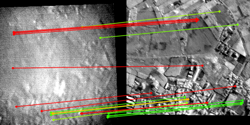
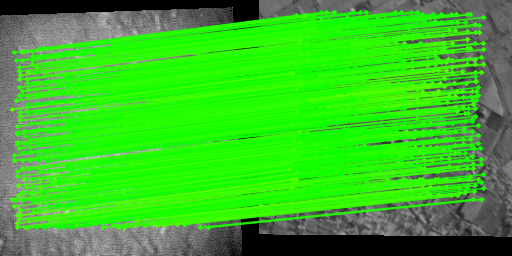

# PoFTR: Physics-Informed Transformer for Cross-Spectral Image Registration

> **ECCV 2026 Submission #1683**

<p align="center">
  
  &nbsp;
  
</p>
<table align="center" width="100%" border="0">
  <tr>
    <td align="center" width="50%"><em>(a) MatchAnything</em></td>
    <td align="center" width="50%"><em>(b) PoFTR (Ours)</em></td>
  </tr>
</table>

Cross-spectral image registration in remote sensing is fundamentally challenged
by extreme appearance discrepancies: even images of the same scene captured in
different LWIR bands can exhibit severe radiometric inversions, where local
contrast polarities completely reverse across modalities. Standard
transformer-based matchers, despite strong RGB performance, are appearance-driven
and collapse under these non-monotonic radiometric phenomena.

**PoFTR** addresses this by embedding physically grounded temperature priors
directly into the feature matching pipeline. Rather than treating spectral bands
as generic image channels, PoFTR leverages the fact that surface temperature —
governed by Planck's law — is a spectrally consistent physical quantity
recoverable across all LWIR modalities, and uses it as a conditioning signal via
**Spatial Feature Transform (SFT)** layers.

---

## Contributions

- **AeroSync** — a large-scale synthetic LWIR multispectral dataset combining
GAN-based spectral synthesis (PETIT-GAN) with a 6-DoF view simulator, producing
pixel-aligned PAN / 9µm / 11µm image triplets with controlled viewpoint overlap
and calibrated covisibility distributions.

- **PoFTR** — a physics-informed transformer that integrates PETIT-S temperature
priors at multiple feature hierarchy levels (input, coarse, fine), enabling
spatially varying feature modulation without altering the core matcher
architecture.

---
## Key Results
### Real World Results:

<table>
  <thead>
    <tr>
      <th>Dataset</th>
      <th>Method</th>
      <th>Inlier Ratio (%) ↑</th>
      <th># Inliers ↑</th>
    </tr>
  </thead>
  <tbody>
    <tr>
      <td rowspan="3">9µm–PAN</td>
      <td>MatchAnything</td>
      <td>31.2 ± 33.5</td>
      <td>5.4 ± 6.2</td>
    </tr>
    <tr>
      <td>XoFTR</td>
      <td>93.5 ± 2.7</td>
      <td>722.7 ± 23.1</td>
    </tr>
    <tr>
      <td><strong>PoFTR (ours)</strong></td>
      <td><strong>99.9 ± 0.3</strong></td>
      <td><strong>783.4 ± 2.5</strong></td>
    </tr>
    <tr>
      <td rowspan="3">11µm–PAN</td>
      <td>MatchAnything</td>
      <td>34.1 ± 31.6</td>
      <td>9.6 ± 15.5</td>
    </tr>
    <tr>
      <td>XoFTR</td>
      <td>99.9 ± 0.4</td>
      <td>783.1 ± 2.9</td>
    </tr>
    <tr>
      <td><strong>PoFTR (ours)</strong></td>
      <td><strong>99.9 ± 0.3</strong></td>
      <td><strong>783.4 ± 2.5</strong></td>
    </tr>
    <tr>
      <td rowspan="3">9µm–11µm</td>
      <td>MatchAnything</td>
      <td>68.5 ± 17.3</td>
      <td>781.5 ± 580.3</td>
    </tr>
    <tr>
      <td>XoFTR</td>
      <td>99.9 ± 0.1</td>
      <td>783.9 ± 0.3</td>
    </tr>
    <tr>
      <td><strong>PoFTR (ours)</strong></td>
      <td><strong>99.9 ± 0.1</strong></td>
      <td><strong>783.9 ± 0.7</strong></td>
    </tr>
  </tbody>
</table>

> For full benchmark results across all spectral configurations and baselines on the AeroSync dataset, see Table 1 in the paper.


---

## Installation

**1. Clone the repository**
```bash
git clone https://anonymous.4open.science/r/PoFTR-6217/
cd PoFTR
```

**2. Create and activate the environment**
```bash
conda env create -f environment.yml
conda activate poftr
```

**3. Download data and checkpoints**

Download the dataset and pretrained checkpoints from the
[dataset link](https://bit.ly/PoFTR_Dataset) and place them under `data/`
and `checkpoints/` respectively, as described in the [Evaluation](#evaluation)
section.

## Training (Fine Tunning)
### PoFTR

> **Note:** Pretrained checkpoints for all models are available in the
> [dataset link](https://bit.ly/PoFTR_Dataset). The following is only needed
> if you wish to fine-tune the models yourself on the AeroSync dataset.

All training settings are configured in `src/configs/poftr_configs.py`. 
The key fields to set before fine-tuning:
```python
config['poftr']['proj']['base_model'] # 'xoftr', 'loftr', or 'aspanformer'
config['poftr']['phys']['use_phys']   # True = PoFTR, False = baseline
config['data']['dataset_version']     # '9um_pan', '11um_pan', or '9um_11um'
config['poftr']['pretrained_ckpt']    # path to pretrained backbone weights
```

Then run:
```bash
cd training_scripts
python train.py
```

Checkpoints are saved automatically and the best validation checkpoint is
tested at the end of training.

### PETIT-S
PETIT-S is the lightweight temperature prior network distilled from PETIT-GAN.
Pretrained PETIT-S weights are provided in the checkpoint download and are
sufficient to reproduce all results. The following is only needed if you wish
to fine-tune PETIT-S yourself.

Set the target band and fold in `src/dataset/physical_model/petit_s/utils/petits_configs.py`:
```python
cfg.DATA.wl        = "11um"  # "9um" or "11um"
cfg.RUN.fold_idx   = 0       # 0–4 for 5-fold cross-validation
cfg.PROJ.cwd       = "path/to/PoFTR"
cfg.PHYS.coeff_path = "path/to/coefficients_{wl}.npz"
```

Then run:
```bash
cd training_scripts
python train_petit_s.py
```

Repeat for each fold (`fold_idx` 0–4) and each band (`9um`, `11um`).
## Evaluation

### Prerequisites

**1. Clone the repository and set up the environment**
```bash
git clone https://anonymous.4open.science/r/PoFTR-6217/
cd PoFTR
conda env create -f environment.yml
conda activate poftr
```

**2. Download data and checkpoints**

Download the dataset and pretrained checkpoints from the [dataset link](https://bit.ly/PoFTR_Dataset)
and place them according to the following structure:
```
PoFTR/
├── data/
│   ├── real_world/          ← real-world .npz files
│   ├── csv_outputs/         ← matched pairs CSVs
│   ├── simulated/           ← AeroSync webdataset shards
│   └── physical_model/      ← PETIT-GAN calibration coefficients
└── checkpoints/
    └── best/                ← pretrained model checkpoints
```

**3. Configure paths**

Edit `configs/eval_config.yaml` to set your local paths:
```yaml
checkpoint_base: checkpoints
data_root:        data/real_world
sim2real_csv_dir: data/csv_outputs
stats_base:       data/simulated/datasets/truncnorm
coeff_dir:        data/physical_model/coeffs
results_dir:      evaluation_results
```

---

### Reproduce AeroSync Benchmark

Evaluates PoFTR and baselines on the AeroSync synthetic test set across all three
spectral configurations (9µm–PAN, 11µm–PAN, 9µm–11µm).

To evaluate **PoFTR**:
```yaml
# configs/eval_config.yaml
model_name: xoftr
use_phys:   true
```

To evaluate a **baseline** (e.g. XoFTR):
```yaml
# configs/eval_config.yaml
model_name: xoftr   # or: loftr, aspanformer
use_phys:   false
```

Then run:
```bash
python eval_aerosync.py
```

Results (Pose Success, MMA@3, #Inliers) will be printed to the terminal and saved to:
```
evaluation_results/aerosync_results.csv
```

---

### Reproduce Sim-to-Real Generalization

Evaluates MatchAnything, XoFTR, and PoFTR on real-world aerial captures across
all three cross-spectral configurations (9µm–PAN, 11µm–PAN, 9µm–11µm).
No configuration changes are needed — all three models are evaluated automatically.
```bash
python eval_sim2real.py
```

Results (Inlier Ratio, #Inliers) will be printed to the terminal and saved to:
```
evaluation_results/sim2real_results.csv
evaluation_results/{band_pair}/{model}_detailed.csv
```

## Citation

*Available after review.*